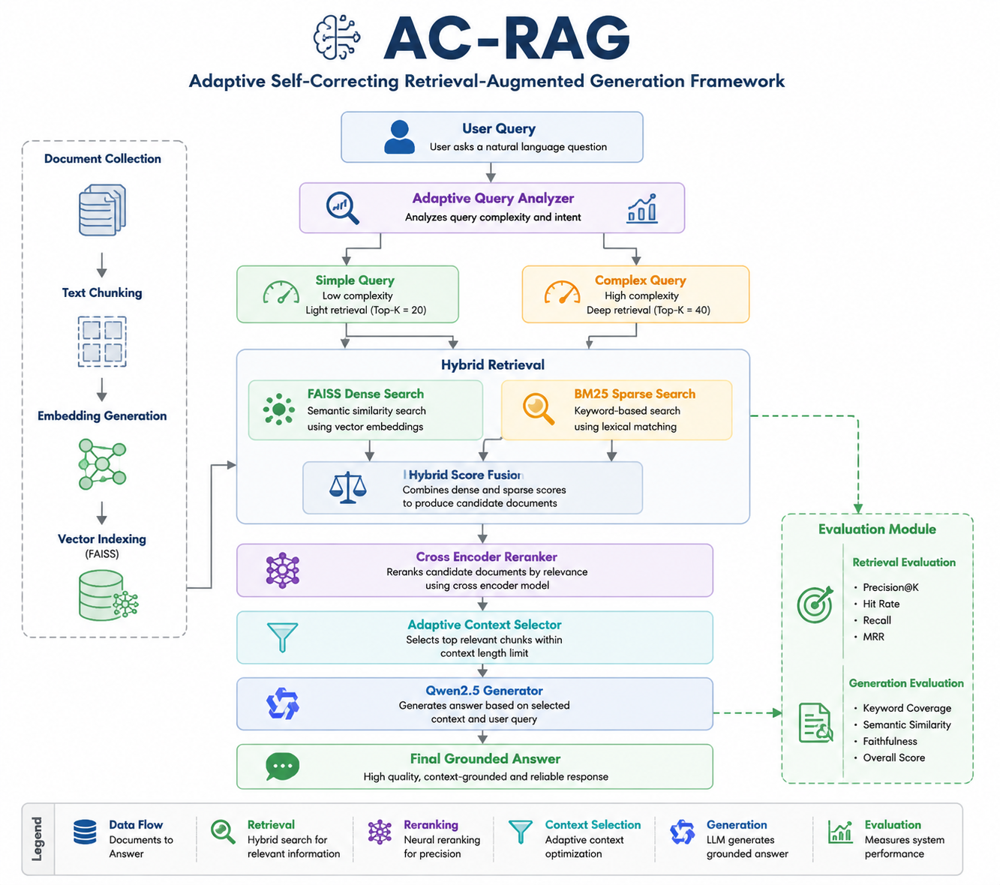

<div align="center">

# 🧠 AC-RAG

## Adaptive Self-Correcting Retrieval-Augmented Generation Framework

<div align="center">



</div>

A Research-Oriented RAG Framework Combining  
Hybrid Retrieval, Adaptive Query Analysis, Neural Reranking, and LLM Generation


</div>


# 📌 Overview

**AC-RAG (Adaptive Self-Correcting Retrieval-Augmented Generation)** is a research-oriented Retrieval-Augmented Generation framework designed to improve the reliability, relevance, and accuracy of Large Language Model (LLM) responses.

Traditional RAG systems often suffer from irrelevant retrieval, insufficient context, and inaccurate generation. AC-RAG addresses these challenges by introducing:

- Adaptive query complexity analysis
- Hybrid retrieval mechanism
- Neural document reranking
- Dynamic context selection
- Context-grounded LLM generation
- Automated retrieval and generation evaluation


The framework integrates dense and sparse retrieval techniques with adaptive decision-making to provide high-quality knowledge-grounded responses.


---

# 🚀 Key Features


## 🔍 Hybrid Retrieval

AC-RAG combines two retrieval approaches:

### Dense Retrieval

Using:

```
FAISS + BAAI/bge-small-en-v1.5
```

for semantic similarity search.


### Sparse Retrieval

Using:

```
BM25
```

for keyword-based matching.


The combination improves both semantic understanding and exact term retrieval.


---

# 🧩 Adaptive Query Analysis

AC-RAG automatically analyzes user queries and adjusts retrieval depth.


Example:

```
Simple Query
      |
      ↓
Light Retrieval


Complex Query
      |
      ↓
Deep Retrieval
```


Complex queries receive more candidate documents for improved coverage.


---

# 🎯 Neural Reranking

Retrieved documents are refined using:

```
BAAI/bge-reranker-base
```


The reranker:

- Evaluates query-document relevance
- Removes noisy contexts
- Improves final context quality


---

# 🤖 Context-Grounded Generation


Generator:

```
Qwen/Qwen2.5-3B-Instruct
```


The model generates answers using retrieved evidence instead of relying only on internal knowledge.


Benefits:

- Reduced hallucination
- Better factual consistency
- Domain-specific responses


---

# 🏗️ System Architecture


```
                    User Query
                         |
                         ↓

              Adaptive Query Analyzer

                         |
          --------------------------------
          |                              |
     Simple Query                 Complex Query
          |                              |
          --------------------------------

                         |
                         ↓

              Hybrid Retrieval Layer

          -------------------------------
          |                             |
       FAISS                         BM25
   Semantic Search              Keyword Search

          -------------------------------
                         |
                         ↓

              Candidate Documents

                         |
                         ↓

              Cross Encoder Reranker

                         |
                         ↓

             Adaptive Context Selection

                         |
                         ↓

              Qwen2.5 Generator

                         |
                         ↓

                 Final Response

                         |
                         ↓

               Evaluation Module

```


---

# 🔄 AC-RAG Workflow


```
Documents
    |
    ↓
Text Chunking
    |
    ↓
Embedding Generation
    |
    ↓
FAISS Index Creation
    |
    ↓
Hybrid Retrieval
    |
    ↓
Adaptive Query Processing
    |
    ↓
Document Reranking
    |
    ↓
Context Selection
    |
    ↓
LLM Generation
    |
    ↓
Evaluation
```


---

# 🧠 Core Components


## 1. Document Processing

Functions:

- Document loading
- Text chunking
- Embedding generation
- Vector indexing


---

## 2. Embedding Model


Model:

```
BAAI/bge-small-en-v1.5
```


Purpose:

- Semantic representation
- Vector similarity search


---

## 3. Hybrid Retriever


Components:

| Method | Purpose |
|-|-|
| FAISS | Semantic retrieval |
| BM25 | Keyword retrieval |
| Fusion | Combined ranking |


---

## 4. Adaptive Retrieval Module


The module determines query complexity:

### Simple Queries

Example:

```
What is RAG?
```


### Complex Queries

Example:

```
What are the methods used to improve retrieval quality in RAG systems?
```


Complex queries retrieve deeper context.


---

## 5. Reranking Module


Model:

```
BAAI/bge-reranker-base
```


Improves:

- Document relevance
- Context quality
- Retrieval precision


---

## 6. Generation Module


Model:

```
Qwen2.5-3B-Instruct
```


Generates final answers from retrieved knowledge.


---

# 📂 Project Structure


```
AC-RAG/

│
├── embeddings_v2/
│   ├── faiss.index
│   └── chunks.pkl
│
├── retrieval/
│   ├── retriever.py
│   ├── adaptive_retriever.py
│   ├── reranker.py
│   └── test_adaptive.py
│
├── generation/
│   ├── qwen_generator.py
│   ├── rag_answer.py
│   └── test_qwen.py
│
├── evaluation/
│   ├── retrieval_metrics.py
│   ├── generation_metrics.py
│   └── test_questions.json
│
├── requirements.txt
├── README.md
└── .gitignore

```


---

# ⚙️ Installation


Clone repository:

```bash
git clone https://github.com/yourusername/AC-RAG.git

cd AC-RAG
```


Create virtual environment:

```bash
python -m venv venv
```


Activate:

Windows:

```bash
venv\Scripts\activate
```


Install dependencies:

```bash
pip install -r requirements.txt
```


---

# ▶️ Usage


## Test Retrieval


```bash
python retrieval/test_adaptive.py
```


## Generate Answers


```bash
python generation/rag_answer.py
```


## Retrieval Evaluation


```bash
python evaluation/retrieval_metrics.py
```


## Generation Evaluation


```bash
python evaluation/generation_metrics.py
```


---

# 📊 Evaluation Results


## Retrieval Performance


| Metric | Score |
|-|-:|
| Precision@K | 0.617 |
| Hit Rate | 0.800 |


---

## Generation Performance


| Metric | Score |
|-|-:|
| Keyword Coverage | 0.867 |
| Semantic Similarity | 0.854 |
| Overall Generation Score | 0.858 |


---

# 🤖 Models Used


| Component | Model |
|-|-|
| Embedding | BAAI/bge-small-en-v1.5 |
| Reranker | BAAI/bge-reranker-base |
| Generator | Qwen2.5-3B-Instruct |


---

# 💻 Hardware Configuration


Test Environment:


| Component | Specification |
|-|-|
| GPU | NVIDIA RTX 4050 Laptop GPU |
| RAM | 16 GB |
| Framework | PyTorch + HuggingFace |


---

# 🔮 Future Improvements


Future development directions:

- Larger benchmark evaluation dataset
- Automatic self-correction feedback loop
- Citation-aware generation
- Multi-document reasoning
- Web-based interactive interface
- Domain-specific adaptation


---

# 📚 Technologies


- Python
- PyTorch
- HuggingFace Transformers
- Sentence Transformers
- FAISS
- BM25
- Cross Encoder
- Qwen LLM


---

# 📜 License


MIT License


---

# ⭐ Acknowledgement


This project explores adaptive retrieval strategies for improving Retrieval-Augmented Generation systems and advancing reliable LLM-based applications.
